## Computer Vision ✏

 

**Week 1 Transformation** 	[1. Image Stitching](#-1-image-stitching) 

**Week 2 Histogram** 	[2. PDF and CDF](#---2-compute-pdf-and-cdf-from-grayscale-image)  /  [3. Histogram Stretching](#-3-histogram-stretching)  /  [4. Histogram Equalization](#-4-histogram-equalization)  /  [5. Histogram Matching](#-5-histogram-matching) 

**Week 3 Filtering(Convolution)** 	[6. Mean Filter](#-6-mean-filter)  /  [7. Gaussian Filter](#-7-gaussian-filter) 	[8. Sobel Filter](#-8-sobel-filter)  /  [9. Laplacian Filter](#-9-laplacian-filter)  /  [10. Unsharp Masking](#-10-unsharp-masking) 

**Week 4 Noise generation & restoration** 	[11. Salt and Pepper Noise (generation/removal)](#-11-salt-and-pepper-noise-generationremoval)  /  [12. Gaussian Noise (generation/removal)](#-12-gaussian-noise-generationremoval) 

**Week 5 Segmentation** 	[13. Adaptive Thresholding](#-13-adaptive-thresholding)  /  [14. K means Clustering](#-14-k-means-clustering)   /   [Mean Shift](#--mean-shift)

**Week 6 Edge&Corner detection** 	[15. Laplacian of Gaussian](#-15-laplacian-of-gaussian)  /  [16. Canny edge detector](#-16-canny-edge-detector)  /  [17. Harris corner detector](#-17-harris-corner-detector)

**Week 7 Find and match corresponding points** 	[18. SIFT](#-18-sift)  /  [19. SURF](#-19-surf)

**Week 8 Image stitching** [20. Using SIFT]  /  [21. Using SIFT + RANSAC] 

### 📌 1. Image stitching 

This code creates a blend stitched image from two input images through the process below.  

1. Estimate affine transformation. If you have at least 3 pairs of corresponding pixels, affine transformation can be computed with formula. 
2. Compute the size of a final merged image I_F. This is done by computing p1, p2, p3, p4 using A21(affine transformation from I2 to I1).
3. Inverse warping using A12.
4. Blend stitch two images I1 and I2'(= affine transformed I2 = output of inverse warping).

> **Note**
>
> Corresponding pixels of two images are given in advance. Uses bilinear interpolation when inverse warping.  Change the value of 'alpha' (parameter of blend_stitching()) to change the ratio of I1 and I2. Alpha must be float value between 0 and 1, and bigger alpha makes overlapping area closer to I1.

Stitched Result 👇

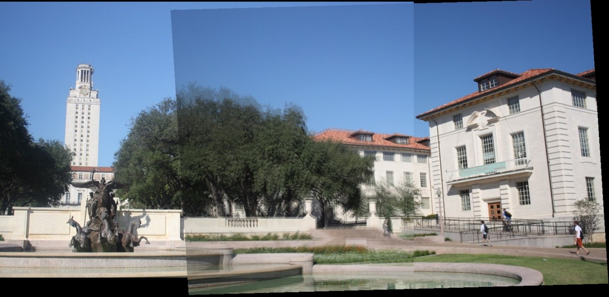

### <mark style='background-color: #d0b8ff'>  </mark>📌 2. Compute PDF and CDF from grayscale image

In order to compute PDF(Probability Density Function) and CDF(Cumulative Distribution Function), we need grayscale image. This code converts RGB input image into grayscale image. Then computes PDF and CDF from grayscale image.  
PDF and CDF are saved as .txt file after running the code. 

RGB to Grayscale result 👇 
    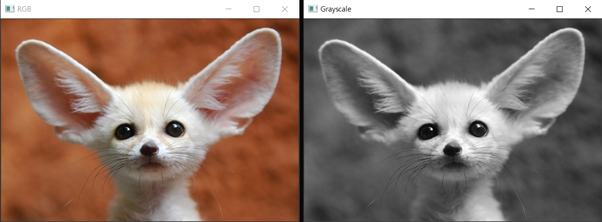

PDF, CDF plot result 👇 
    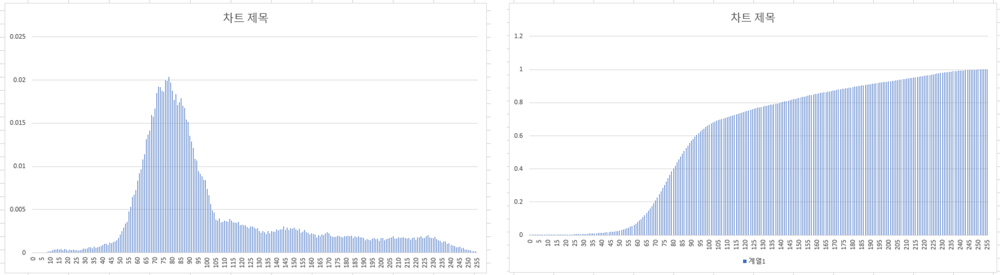

### 📌 3. Histogram stretching

This code creates higher contrast image by stretching histogram.

> **Note**
>
> Uses linear function for stretching. To customize linear function, change x1, x2, y1, y2 values. These are parameters of linear_stretching() function.

Original grayscale image & stretched image 👇 
    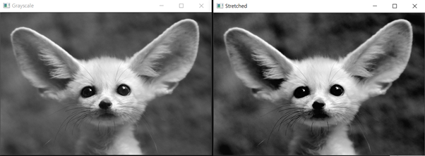

PDF histogram 👇 (left: before stretching, right: after stretching) 
    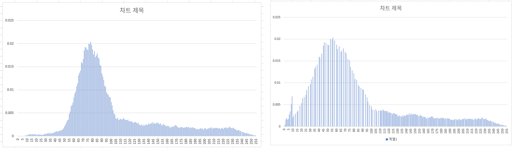

### 📌 4. Histogram equalization

This code creates higher contrast image by histogram equalization. Histogram equalization is similar to histogram stretching in the way that it results to higher contrast outcome. However, unlike histogram stretching, histogram equalization is fully automatic. In other words, setting parameters for linear equation is not needed.

- **Grayscale**

  Grayscale - histogram equalized result 👇  
      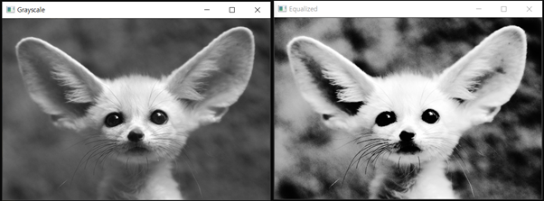

  PDF histogram 👇 
      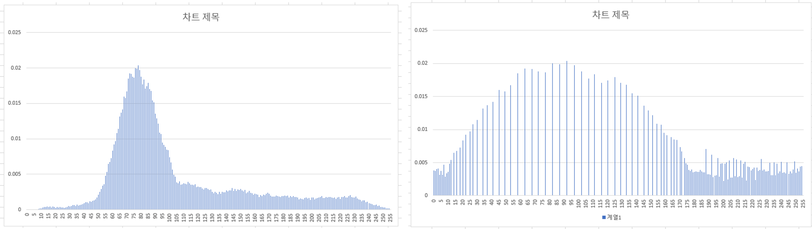

- **RGB**

  What would be the result if you apply histogram equalization on each channel of RGB color image? Would it be higher contrast color image? No, It results to color distortion. 

  
  
  Histogram equalization on RGB channels 👇 
      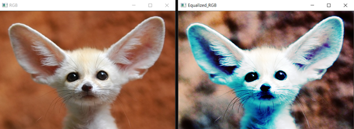
  
  

- **YUV**

  To avoid color distortion, apply histogram equalization on Y channel. Y channel has intensity values of light on the image. By applying histogram equalization, you get higher contrast color image.

  
  
  Histogram equalization on YUV 👇 
      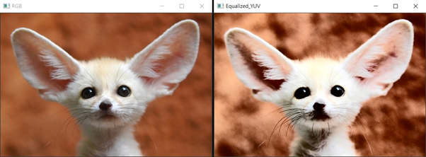

### 📌 5. Histogram matching

Histogram matching creates result image with reference image or reference histogram. Different reference, different result.

- **Grayscale**

   👈 reference 1

  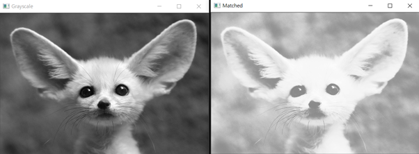 👈 Histogram matched result

  With bright, low contrast reference image, the intensity values of original image became similar to the reference.

  

  

   👈 reference 2

  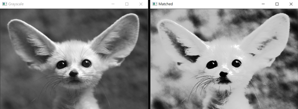 👈 Histogram matched result

- **YUV**

  For color image, histogram matching is applied on Y channel. 

  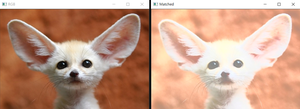

  This is the outcome using reference 1.

### 📌 6. Mean filter

This code generate blurry image by applying mean filter. Adjusting boundary procedure precedes mean filtering.  

> **Note**
>
> There are three boundary processes in this code. Zero padding, Mirroring, Adjust kernel. Change last parameter of meanfilter() function. Choose from [ zero-paddle / mirroring / adjustkernel ]

- Grayscale

  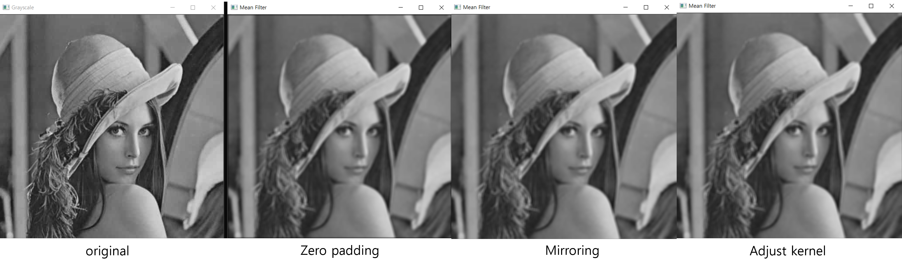

- RGB

  

Zero padding output images have dark boundary. This is because zero padding fill padding area with '0' resulting smaller mean value around boundary. 

### 📌 7. Gaussian filter

Unlike mean filtering, Gaussian filtering consider spatial distance. Resulting more natural output image. 

Another noticeable characteristic of Gaussian filtering is that it is separable. This is important because output is completely same but run time is shorter.

> Note 
>
> Change boundary process by adjusting parameter of gaussianfilter() function.  Choose from [ zero-paddle / mirroring / adjustkernel ]. 
>
> There are 4 cpp codes, Gaussian filtering on grayscale image, Gaussian filtering on RGB image, Gaussian filtering on grayscale image with separable manner and Gaussian filtering on RGB image with separable manner.

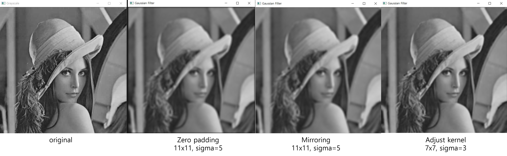

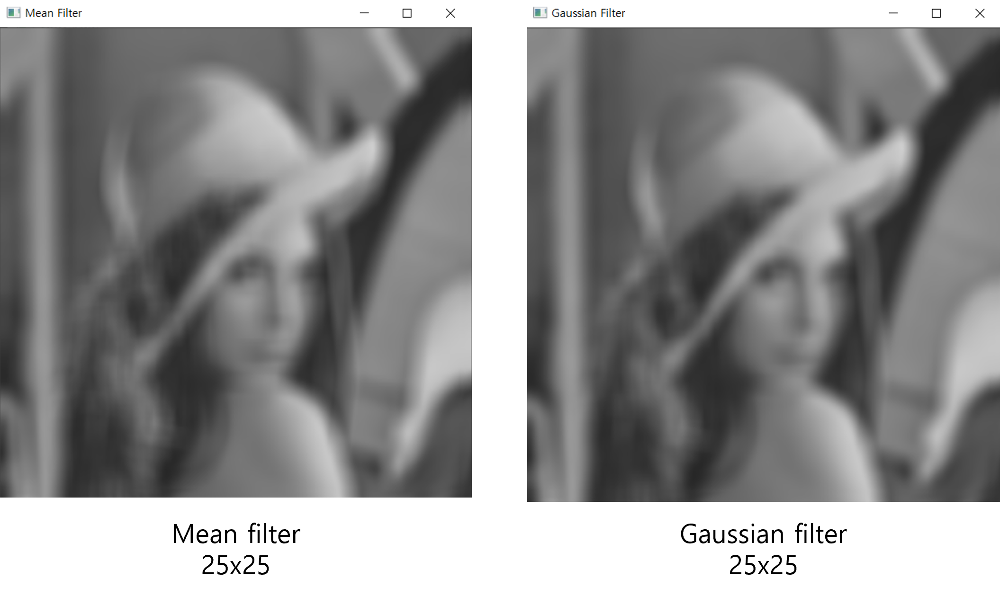

With small kernel size, mean filtering result and Gaussian filtering result seems similar. However with bigger kernel size, you can see that Gaussian filtering is much natural than mean filtering.

### 📌 8. Sobel filter

Sobel filtering extracts edge of the image.  Finding edge can be done by finding rapid change of the neighboring pixels.

- Grayscale 

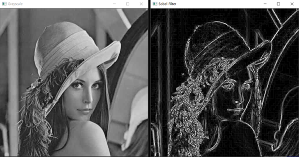

- RGB

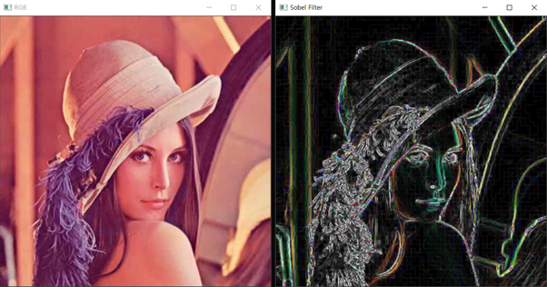

### 📌 9. Laplacian filter

Laplacian filtering is also high-pass filter that extracts edge of the image.  Finding edge can be done by finding rapid change of the neighboring pixels.

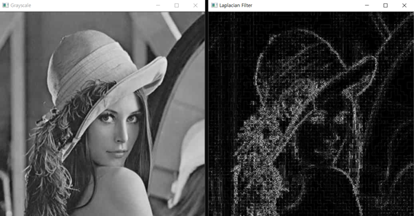

### 📌 10. Unsharp masking

Unsharp masking create more vivid image by removing low frequency. 

Find low frequency by applying low-pass filtering such as mean filter or Gaussian filter. Then, by subtracting low-pass output, only high frequency is left on the image, resulting vivid image. 

> Note 
>
> Change parameter of unsharpmask() function.  Choose boundary process from [ zero-paddle / mirroring / adjustkernel ]. Last parameter is k value which decides strength of unsharp masking. 

- Grayscale

  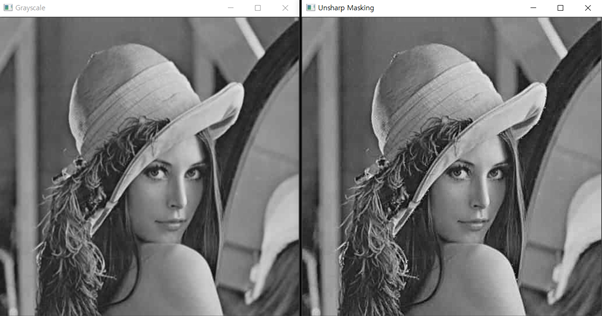

  ☝ Gaussian filter, n=1, sigma=1, boundary process=mirroring, k=0.5

  

- RGB

  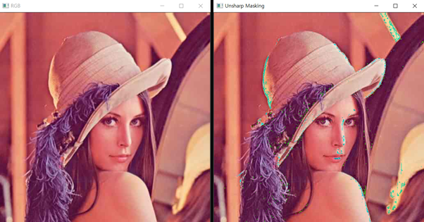

  ☝ Gaussian filter, n=1, sigma=1, boundary process=mirroring, k=0.5

You can see that the result of unsharp masking on RGB channel is quite different from expected result. This probably happened because we did not consider intensity difference of each channel. 

### 📌 11. Salt and pepper noise (Generation/Removal)

This code is to generate salt-and-pepper noise on random pixels of the image, then remove salt-and-pepper noise. Noise are randomly scattered on image. Salt is white(255) noise pixels and pepper is black(0) noise pixels.  Removing salt-and-pepper is done by median filtering.

> **Note**
>
> To change density of noise, change parameters of Add_salt_pepper_Noise() function. 2nd parameter is density of salt noise, 3rd parameter is density of pepper noise. Both value must be value between 0~1. By default, both ps and pp is 0.1. To change kernel size, change window_radius value on line 49. Choose boundary process. Choose from 'zero-padding','mirroring','adjustkernel' on last parameter.

- **Noise generation**

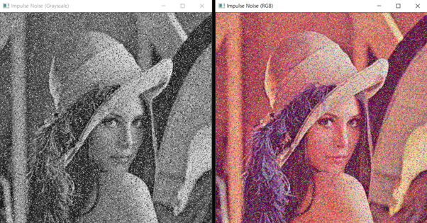

👆 Salt and pepper noise generation on grayscale image and rgb color image.

Salt and pepper noise on color image is not white and black because I applied noise independently on each channel. To generate white and black noise on color image, try modifying code to add salt and pepper noise on same pixel on all three channel.

- **Noise removal - median filtering**

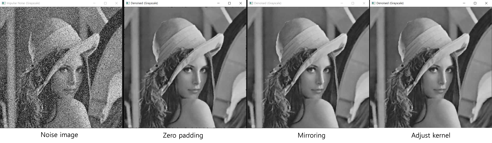

👆 Noise image and Denoised images with different boundary processes

👆 Noise image and Denoised images with different boundary processes

### 📌 12. Gaussian noise (Generation/Removal)

This code generate Gaussian noise on input image.  Then removes Gaussian noise by Gaussian filtering and Bilateral filtering. Bilateral filtering considers not only the distance but also intensity difference or color difference between neighboring pixels.  This prevents blurry edge of Gaussian filtering.

> **Note**
>
> To change density of noise, change parameter of Add_Gaussian_Noise() function. To change kernel size, change second parameter of Gaussian filter function on line 53, 54. To change kernel size, change second parameter of bilateral filter function on line 53, 54. You can also decide boundary process by changing last parameter. 
> Choose one from 'zero-padding', 'mirroring', 'adjustkernel' on last parameter of Gaussian filter function.

- **Noise generation**

  

  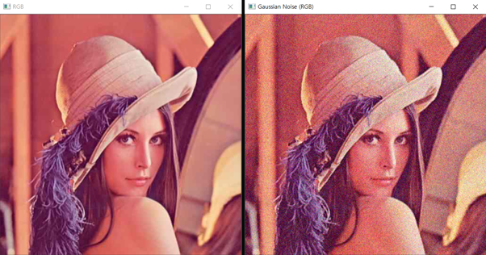

- **Noise removal - Gaussian filtering**

  kernel_size=7, sigma_t=10, sigma_s=10

  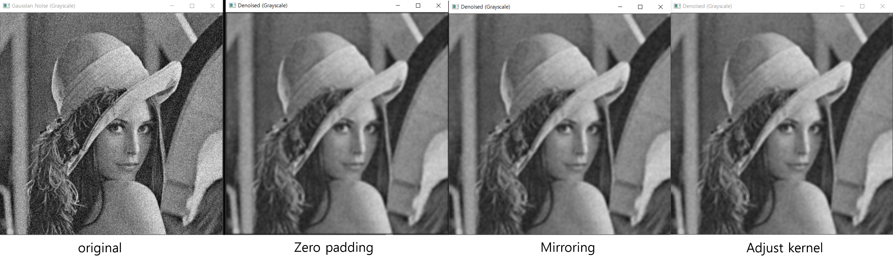

  

- **Noise removal - Bilateral filtering**

  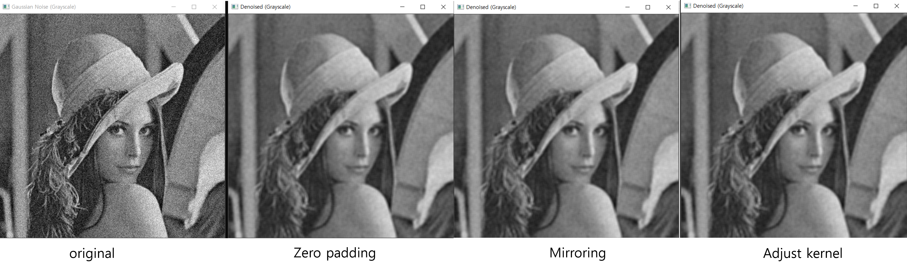

### Image Segmentation

Image segmentation is dividing an image into non-overlapping region with similar information.

### 📌 13. Adaptive thresholding

Adaptive thresholding compute local threshold of each pixel. Using local threshold prevents contamination on shadow area that happens on global thresholding. 

> **Note**
>
> This code uses uniform mean filter and zero-padding. 
>
> To change kernel size, change second parameter of adaptive_thres() function. 
> To change bnumber(constant value multiplied to sum), change last parameter of adaptive_thres() function.

👇 Grayscale image and the output. 

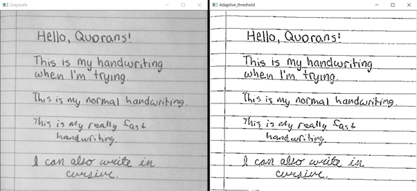

👇 n = 2, bnumber = 0.7 	 **/**  	n = 2, bnumber = 0.9 👆

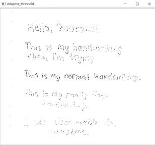

### 📌 14. K means clustering

If we know representative intensity, we can label all the pixels. If we know all the label of each pixel, we can find representative intensity with average. However the problem is that we don’t know both of them. The goal of K means clustering is to find k number of cluster centers by following process.

1. Randomly initialize cluster centers.
2. Classify points by finding which cluster center is the closest. 
3. Update cluster center with points that are classified to the specific cluster. 
4. With updated cluster center, classify points again. 

By repeating these procedures above, you get the final result. 

> **Notes**
>
> This code uses kmeans function from opencv library. 
>
> Choose the number of clusters by changing clusterCount value. Default value is 10. Choose the number of k means process by changing attemps value. Default value is 5.

- Grayscale

  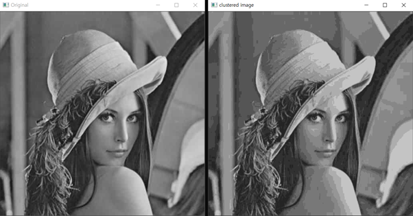

- RGB

  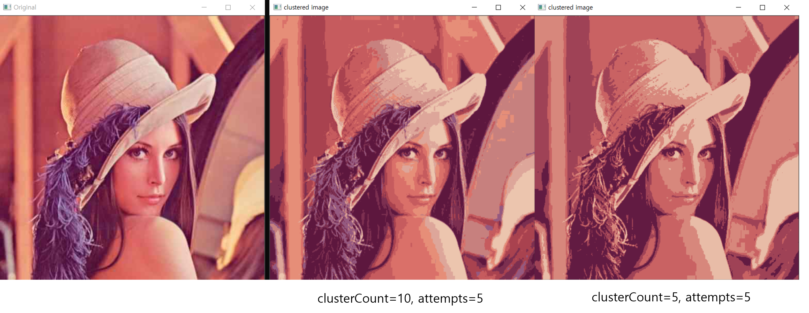

K means clustering also has weaknesses. If random cluster center is badly selected at first, result can have problems. Also, k-mean clustering is sensitive to outliers and the k should be defined manually. In addition it results to spherical clusters which can be different from expected result, because it calculate distance by Euclidean.

### 📌 + Mean shift

Mean shift algorithm seeks modes or local maxima of density in the feature space. K had to be manually defined in K-means clustering but by mean shift doesn't. With random seeds, first calculate mean of a search window. Then shift search window and repeat these procedures. When the mean value doesn’t change anymore, that point is the mode. No matter how many random seeds, final mean value always converge to modes. 

> **Note**
>
> There is opencv library function of mean shift clustering but it doesn't work well.  
>
> So I used a program provided by "EDISON". So, there is no cpp code file for mean shift.

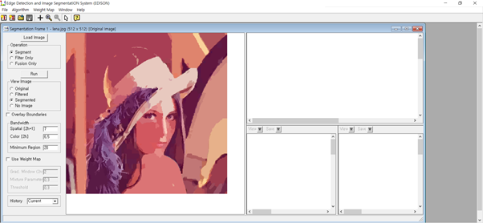

You can change input parameters on the left of this program.

### 📌 15. Laplacian of Gaussian

There are variety of methods to detect edge. To detect edge, you can use high-pass filtering. However, if you simply apply high-pass filtering on the image with noise, you won’t get satisfying result, because the noise area is magnified through high-pass filtering. To overcome this problem, apply low-pass filter like Gaussian filter before applying high-pass filter.  If you use small window for smoothing, localization will be good, but little bit of noise would remain. If you use big window, image get over smoothed so there will be no more noise but result would be blurry. 

This code applies Gaussian filtering to remove noise. Then applies Laplacian filter for edge detection.

> **Note**
>
> Gaussian filter and Laplacian filter both uses mirroring for boundary process. You can change window size and sigma of Gaussian filter on line 32~34. Default window_radius is 2, sigma_t is 2 and sigma_s is 2.

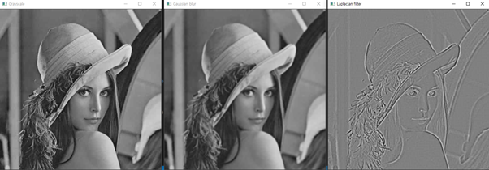

### 📌 16. Canny edge detector

Canny edge detection finds optimal variance of low-pass filtering. With Canny method, precise location of edge is computed with single pixel. Key idea of Canny edge detection is non-maximum suppression which is surviving only pixels with a larger edge magnitude within a small window. 

> **Note**
>
> This code uses Canny function provided by opencv.
>
> Change parameters of Canny function on line 27. 3rd parameter is first threshold and 4th parameter is second threshold. 5th parameter is the variance of Gaussian filter.

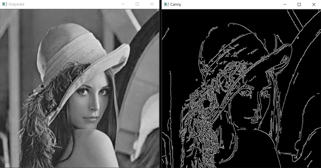

👆 Threshold 50, 130

### 📌 17. Harris corner detector

> **Note** Uses cornerHarris() function from opencv. cornerHarris() returns corner response value R.

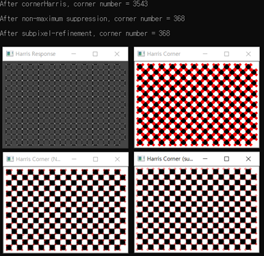

Top left is the Harris response result. Top right is the result of corner points. By comparing response result and threshold value, only pixels that passes threshold are considered as corner points. 

Bottom left is the result after non-maximum suppression. This is similar to canny edge detector non-maximum suppression but the difference is that canny edge considers direction but harris corner only judge whether center of the window is the maximum or not.  

Bottom right is the result after subpixel refinement. This uses cornerSubPix() function. 

The number of corner points of each process are also printed on the screen.

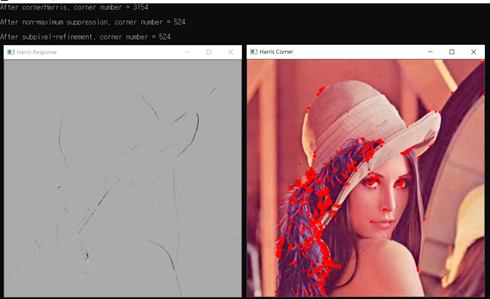

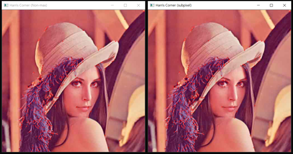

### 📌 18. SIFT

Sift invariant blob detector finds distinct points of the image. Then finds corresponding pairs of points by comparing distinct points of two image.

> **Procedure:** 
>
> First is scale-space extrema detection. We should consider both scale and space. So, find maximum from different scales, and find maximum within spatial neighbors. Find out whether it is the peek point or not just like non-maximum suppression.  Second procedure is key point localization.  Third is orientation assignment. Take 16 by 16 window, compute edge orientation for each 2 by 2 block. Then, throw out weak edges, and create histogram by accumulating the Gaussian weighted edge magnitude.  Last step is descriptor construction. 
>
> Next is feature matching. One feature can match the other if these are nearest neighbors and distance between is small enough. Problem is it’s reliability. By cross-checking, reliability problem can be solved. However, problem happens when there are two similar result. By using threshold ratio, we can check whether it is reliable or not. If the ratio is close to 1, then it is not reliable. 

> **Note**
>
> On line 87, you can change cross checking option. Default is "true".
> On line 88, you can change ratio threshold option. Default is "true".
> To change ratio threshold value, change value on line 184. Default is 0.8.

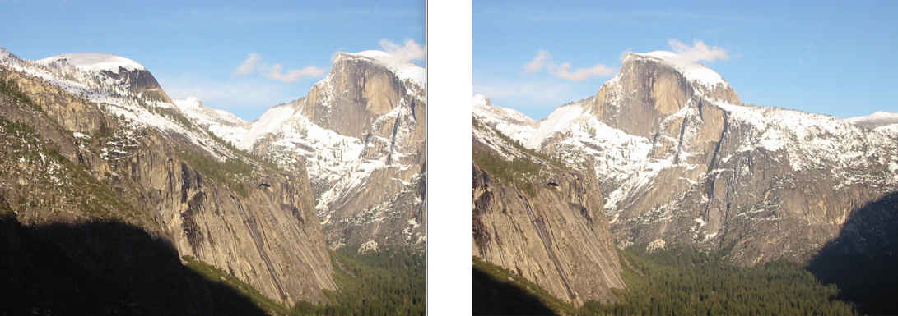

👆 input1, input2

There are two image as input images. These two images are photo of a same mountain but in slightly different view. This code finds distinct points of each image then find correspondence of distinct points.

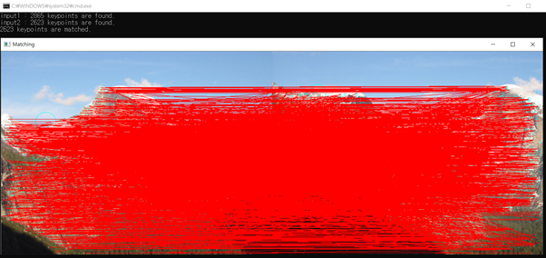

👆 ratio_threshold=false, crosscheck=false 

Both options are set false. Which means, all the points are connected. 2865 keypoints are found on input1, 2623 keypoints are found on input2. 

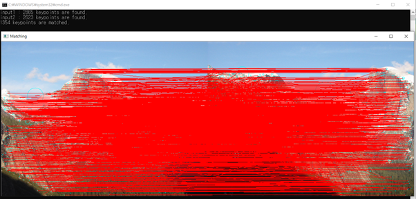

👆 ratio_threshold=false, crosscheck=true

Filtered out corresponding pairs by cross checking. Matched pairs have decreased to 1354.

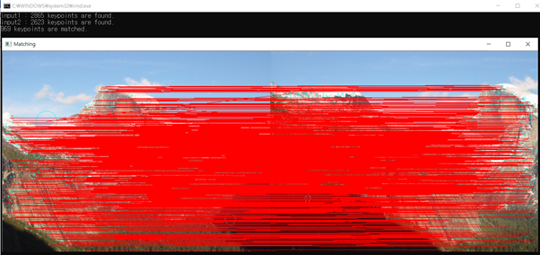

👆 ratio_threshold=true, crosscheck=true, threshold = 0.8

Both options are set true. Matching pairs have decreased to 969.

### 📌 19. SURF

> **Procedure:**
>
> 1. Detect the keypoints using SURF detector
> 2. Calculate descriptors (feature vectors)
> 3. Match descriptor vectors using FLANN matcher
> 4. Calculate max and min distances between keypoints
> 5. Filter out good matches (distance <= min_distance*3)

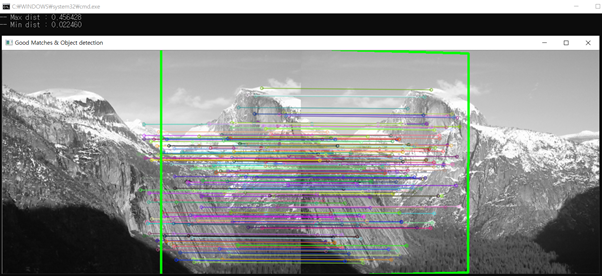

### 📌 20. Image stitching using SIFT

Uses SIFT to find matching pairs.

> On line 91, change cross checking option. Default is "true".
> On line 92, change ratio threshold option. Default is "true".
> To change ratio threshold value, change value on line 247. Default is 0.8.
> On line 159, you can change alpha value for blend stitching. Default is 0.5.

The number of key points found on each input image and the number matched pairs are printed on screen.

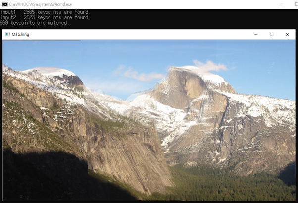

👆 Nearest neighbor inverse warping

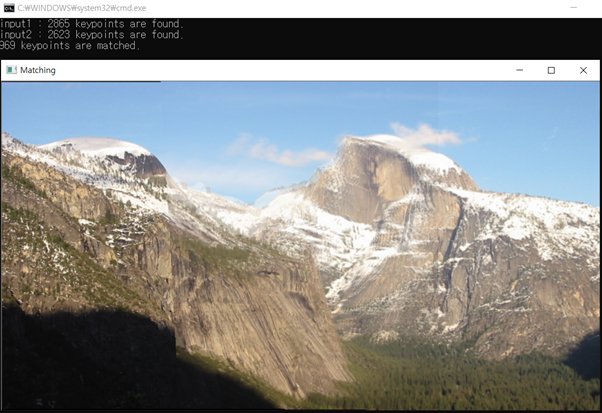

👆 Bilinear inverse warping

### 📌 21. Image stitching using RANSAC

This code uses SIFT to find matching pairs and uses RANSAC for computing affine transformation matrix.

RANSAC is robust to outliers, applicable for larger number of objective function parameters than Hough transform. Also, choosing optimal parameters are easier than Hough transform. However, it’s computational time grows quickly with fraction of outliers and number of parameters, and it is not good for getting multiple fits, because it only produces one result. 

> **Procedure**:
>
> 1. Sample 2 points(number of points can be different) randomly to fit the model. 
> 2. Second is line fitting with sampled points. Solve for model parameters using samples. 
> 3. Find the fraction of inliers within a preset threshold of the model. 
> 4. Then repeat these three process until the best model is found with high confidence. 
>
> There are three parameters to set. The number of trials, number of sampled points, and threshold.

>**Note**
>
>On line 94, you can change cross checking option. Default is "true".
>On line 95, you can change ratio threshold option. Default is "true".
>
>On line 110, 111 you can change parameters of cal_affine() function.
>3rd parameter is number of sampled points, 4th parameter is number of trials, last is distance threshold. Default is 3, 50, 0.3.
>
>To change ratio threshold value, change value on line 250. Default is 0.8.
>On line 162, you can change alpha value for blend stitching. Default is 0.5.

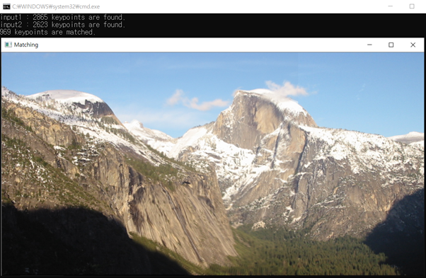

👆 Parameter setting => cal_affine<float>(srcPoints, dstPoints, 3, 50, 0.3);

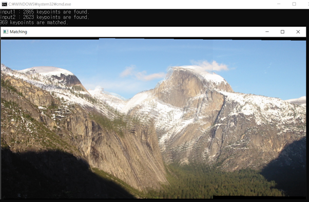

👆 Parameter setting => cal_affine<float>(srcPoints, dstPoints, 3, 10, 0.3);

### 📌 22. Line fitting using Hough transform

Hough transform is a method to fit multiple lines. Key idea is to transform (x, y) to (a, b). 

Hough transformation is robust to outliers, fairly efficient, and provides multiple good fits. However, it is sensitive to noise, there is bin size trades off, and it is not suitable for more than a few parameters.

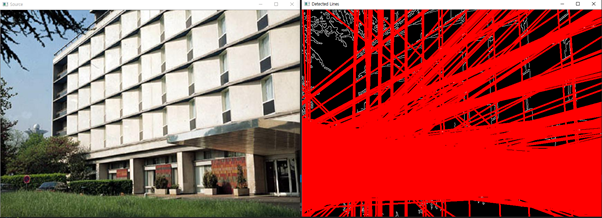

👆 HoughLines

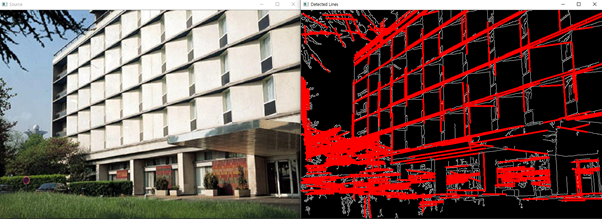

👆 HoughLinesP

