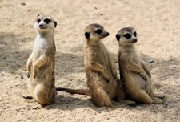

## Computer Vision ✏

### <mark style='background-color: #d0b8ff'>  </mark><mark style='background-color: #f5f0ff'> 1. Image stitching  </mark>  

This code creates a blend stitched image from two input images.  

> **Note**
>
> Corresponding pixels of two images are given in advance. Uses bilinear interpolation when inverse warping.  Change the value of 'alpha' (parameter of blend_stitching()) to change the ratio of I1 and I2. Alpha must be float value between 0 and 1, and bigger alpha makes overlapping area closer to I1.

Stitched Result 👇

### <mark style='background-color: #d0b8ff'>  </mark><mark style='background-color: #d0b8ff'>  </mark><mark style='background-color: #f5f0ff'> 2. Compute PDF and CDF from grayscale image  </mark>

In order to compute PDF(Probability Density Function) and CDF(Cumulative Distribution Function), we need grayscale image. This code converts RGB input image into grayscale image. Then computes PDF and CDF from grayscale image.  
PDF and CDF are saved as .txt file after running the code. 

RGB to Grayscale result 👇 
    

PDF, CDF plot result 👇 
    

### <mark style='background-color: #d0b8ff'>  </mark><mark style='background-color: #f5f0ff'> 3. Histogram stretching  </mark>

This code creates higher contrast image by stretching histogram.

> **Note**
>
> Uses linear function for stretching. To customize linear function, change x1, x2, y1, y2 values. These are parameters of linear_stretching() function.

Original grayscale image & stretched image 👇 
    

PDF histogram 👇 (left: before stretching, right: after stretching) 
    

### <mark style='background-color: #d0b8ff'>  </mark><mark style='background-color: #f5f0ff'> 4. Histogram equalization  </mark>

This code creates higher contrast image by histogram equalization. Histogram equalization is similar to histogram stretching in the way that it results to higher contrast outcome. However, unlike histogram stretching, histogram equalization is fully automatic. In other words, setting parameters for linear equation is not needed.

- **Grayscale**

  Grayscale - histogram equalized result 👇  
      

  PDF histogram 👇 
      

- **RGB**

  What would be the result if you apply histogram equalization on each channel of RGB color image? Would it be higher contrast color image? No, It results to color distortion. 

  
  
  Histogram equalization on RGB channels 👇 
      
  
  

- **YUV**

  To avoid color distortion, apply histogram equalization on Y channel. Y channel has intensity values of light on the image. By applying histogram equalization, you get higher contrast color image.

  
  
  Histogram equalization on YUV 👇 
      

### <mark style='background-color: #d0b8ff'>  </mark><mark style='background-color: #f5f0ff'> 5. Histogram matching  </mark>

Histogram matching creates result image with reference image or reference histogram. Different reference, different result.

- **Grayscale**

   👈 reference 1

   👈 Histogram matched result

  With bright, low contrast reference image, the intensity values of original image became similar to the reference.

  

  

   👈 reference 2

   👈 Histogram matched result

- **YUV**

  For color image, histogram matching is applied on Y channel. 

  

  This is the outcome using reference 1.

### <mark style='background-color: #d0b8ff'>  </mark><mark style='background-color: #f5f0ff'> 6. Mean filter  </mark>

This code generate blurry image by applying mean filter. Adjusting boundary procedure precedes mean filtering.  

> **Note**
>
> There are three boundary processes in this code. Zero padding, Mirroring, Adjust kernel. Change last parameter of meanfilter() function. Choose from [ zero-paddle / mirroring / adjustkernel ]

- Grayscale

  

- RGB

  

Zero padding output images have dark boundary. This is because zero padding fill padding area with '0' resulting smaller mean value around boundary. 

### <mark style='background-color: #d0b8ff'>  </mark><mark style='background-color: #f5f0ff'> 7. Gaussian filter  </mark>

Unlike mean filtering, Gaussian filtering consider spatial distance. Resulting more natural output image. 

Another noticeable characteristic of Gaussian filtering is that it is separable. This is important because output is completely same but run time is shorter.

> Note 
>
> Change boundary process by adjusting parameter of gaussianfilter() function.  Choose from [ zero-paddle / mirroring / adjustkernel ]. 
>
> There are 4 cpp codes, Gaussian filtering on grayscale image, Gaussian filtering on RGB image, Gaussian filtering on grayscale image with separable manner and Gaussian filtering on RGB image with separable manner.

With small kernel size, mean filtering result and Gaussian filtering result seems similar. However with bigger kernel size, you can see that Gaussian filtering is much natural than mean filtering.

### <mark style='background-color: #d0b8ff'>  </mark><mark style='background-color: #f5f0ff'> 8. Sobel filter  </mark>

Sobel filtering extracts edge of the image.  Finding edge can be done by finding rapid change of the neighboring pixels.

- Grayscale 

- RGB

### <mark style='background-color: #d0b8ff'>  </mark><mark style='background-color: #f5f0ff'> 9. Laplacian filter  </mark>

Laplacian filtering is also high-pass filter that extracts edge of the image.  Finding edge can be done by finding rapid change of the neighboring pixels.

### <mark style='background-color: #d0b8ff'>  </mark><mark style='background-color: #f5f0ff'> 10. Unsharp masking  </mark>

Unsharp masking create more vivid image by removing low frequency. 

Find low frequency by applying low-pass filtering such as mean filter or Gaussian filter. Then, by subtracting low-pass output, only high frequency is left on the image, resulting vivid image. 

> Note 
>
> Change parameter of unsharpmask() function.  Choose boundary process from [ zero-paddle / mirroring / adjustkernel ]. Last parameter is k value which decides strength of unsharp masking. 

- Grayscale

  

  ☝ Gaussian filter, n=1, sigma=1, boundary process=mirroring, k=0.5

  

- RGB

  

  ☝ Gaussian filter, n=1, sigma=1, boundary process=mirroring, k=0.5

You can see that the result of unsharp masking on RGB channel is quite different from expected result. This probably happened because we did not consider intensity difference of each channel. 

